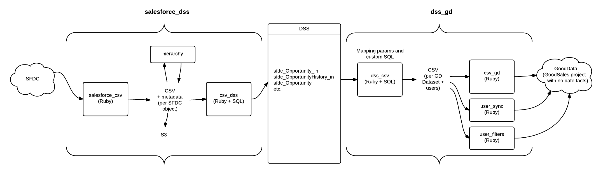

# Referential GoodSales Essentials implementation

## What is it?
It's a referential implementation of GoodSales Essentials ETL on top of BI automation layer (Ruby bricks) and ADS (DSS). It highlights the best practices for implementing BI projects:
* Store all data in DSS
* Do full loads to GD
* Have a separate process for downloading from source to DSS and another  process for transforming and loading from DSS to GD. These can be scheduled independently.
* All processes are restartable.
* Individual pieces of the processes can be run separately for easy debugging.
* The downloader doesn't write directly to DSS, it just downloads CSVs. Data are loaded in a separate brick.
* Raw data are backed up to S3.
* Transformations are done by generated or explicity given SQLs on top of DSS.
* Transformations don't load data directly to GoodData projects. GD upload is done by a separate brick.
* Each dataset has its own transformation which is independent of all others.
* Data that are used for non-analytic purposes (user filters) follow the same process as analytic data. They are loaded to DSS and extracted by SQLs.
* Downloader downloads all available data, no matter which fields are currently used.
* Credentials are separated from the rest of the parameters. 

## Configuration and customization
Configuration of all bricks is done so that: 
* Each little piece can be configured.
* There are presets holding the most usual configuration values. You don't have to configure every little piece, if you're just doing standard stuff.
* Each preset piece of configuration can be overriden on it's own, while keeping the rest of the configuration from the preset.
* The implementation is a white box - you can customize whatever piece you need. Most of the changes you need to make are done through configuration. If that's not enough - it's all just Ruby and SQL, so you can change whatever you want.

* Most of the code is in repositories outside of app store. Bricks just care about orchestration and configuration.

## The big picture

There're two big bricks - `salesforce_dss` and `dss_gd`. These are composed of a number of small bricks. Each brick (small or big) can be run separately.

The ETL is divided to two processes:

1. "E" `salesforce_dss`: Downloads data from Salesforce and loads it to DSS. This process is meant to be run a few times each day. It's composed of the following bricks:
  1. `salesforce_csv`: Downloads data from Salesforce to local CSVs.
  2. `hierarchy`: Recursively unpacks the hierarchy downloaded from Salesforce to pairs user, boss. Only performed if UserRole is downloaded.
  3. `csv_dss`: Creates tables in DSS (if they don't exist yet) and uploads the local CSVs there. 
2. "TL" `dss_gd`: Extracts data from Salesforce and loads it to GD. This process is meant to be run once a day. It's composed of the following bricks:
  1. `dss_csv`: Extracts data from DSS to local CSVs using generated and user-defined SQL queries. There's one SQL for each GD dataset, plus one for synchronizing users.
  2. `csv_gd`: Loads datasets from local CSVs to GD.
  3. `user_sync`: Synchronizes users in the domain and in the project according to the local CSV with users.
  4. `user_filters`: Creates data filters (MUFs) for each user so that they only see opportunities they should see.

## How to run a brick
To run a brick locally, use the following command:
```
bundle exec gooddata -lv -U <gooddata username> -P <gooddata password> -p <project id> \
run_ruby -d apps/<app name>/ --name 'ha' --params <runtime params json file> \
--credentials <credentials params json file>
```
This command simulates execution on the server locally on your computer. On server it will run under the account of the user that deployed the brick, in the project where it's deployed. The GoodData username and password indicate the user the brick will be run under, the project id is for the project on which it will run. 

All default configuration is already contained in each brick. If you need to override some of that configuration you can do so in a json file given by `--params`. Think of these as params passed in the data management console when running or scheduling a process. See the configuration section for details.

Some bricks require credentials outside of the GoodData ones, like credentials to access Salesforce data. These can be passed in a json file through `--credentials`. Credentials act as runtime parameters, they are just separated from the rest of the params. On server these will be hidden parameters. 

### Configuration
Each configuration piece has its namespace and key which is together unique across all bricks. Configuration values are evaluated in the following order:
1. In code defaults. Most of the configuration options have their defaults, so that if you don't pass any value, it will use a default one. E.g. path in s3 bucket where files are stored is by default empty, so all files go to the bucket root.
2. Brick configuration presets. Each brick has configuration presets stored in the `config` folder. E.g. `salesforce_csv` has all its params stored in the namespace `downloader.salesforce`. The presets used in GSE are stored in `apps/salesforce_csv/config/gse.json`. These presets override all default values in code. E.g. the s3 path would be defined in `gse.json` by adding a parameter `s3_backup_path`. The namespace is defined in `SalesforceBulkDownloaderMiddleware` in `salesforce_csv.rb`. 
3. Runtime parameters. You can override defaults and presets for your GSE implementation in so called runtime parameters. These parameters live outside the bricks. In live projects these are passed as schedule parameters. Each key has to have its full namespace, with dots replaced by double underscores (`__`). E.g. the backup path can be set up by adding the following to the json: `"downloader__salesforce__s3_backup_path": "my/something"` This overrides any defaults and presets.

### Example brick run
Let's say you want to run the `salesforce_dss` brick that downloads data from Salesforce and loads them into ADS. 
To do this, you need to provide Salesforce credentials. Create a file `credentials.json` with the following content:
```
{
  "downloader__salesforce__username": "you@gooddata.com",
  "downloader__salesforce__password": "yoursfdcpass",
  "downloader__salesforce__token": "yoursfdctoken",
  "downloader__salesforce__client_id": "your sfdc app id",
  "downloader__salesforce__client_secret": "your sfdc app secret",
  "storage__dss__jdbc_url": "jdbc:dss://secure.gooddata.com/gdc/dss/instances/instanceid"
}
```
The client id and secret params are discussed in [salesforce_csv](salesforce_csv/README.md) docs.

Let's say we wan't to pass some extra, implementation-specific params, like the backup path. Create a file `runtime.json` with contents:
```
{
  "downloader__salesforce__s3_backup_path": "my/something"
}
```
Now you can run the brick using: 
```
bundle exec gooddata -lv -U you@gooddata.com -P yourpass -p pid \
 run_ruby -d apps/salesforce_dss/ --name 'ha' --params runtime.json \
 --credentials credentials.json
```


## Structure of each brick
Most of the functionality is implemented outside of bricks in a separate gem. Bricks just hold configuration presets and orchestrate running code. Each brick has a directory in the app directory
Each brick has the following structure:
* `config` directory contains configuration presets for the brick. 
  * `credentials.json` define which credentials need to be passed to the brick.
  * `gse.json` is a preset for the most common GSE implementation.
* `main.rb` holds the definition of the pipeline - which middlewares and small bricks are used.
* `<brick name>.rb` holds defintion of the brick specific classes. Execute defines how the contained bricks are orchestrated. 


